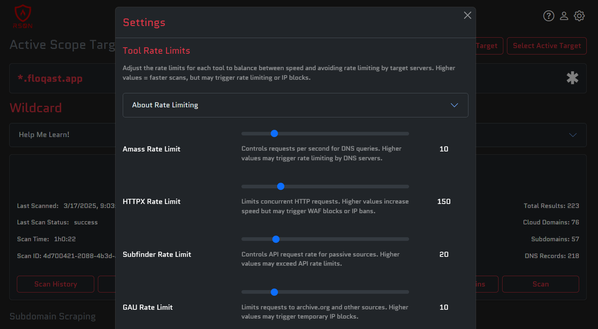
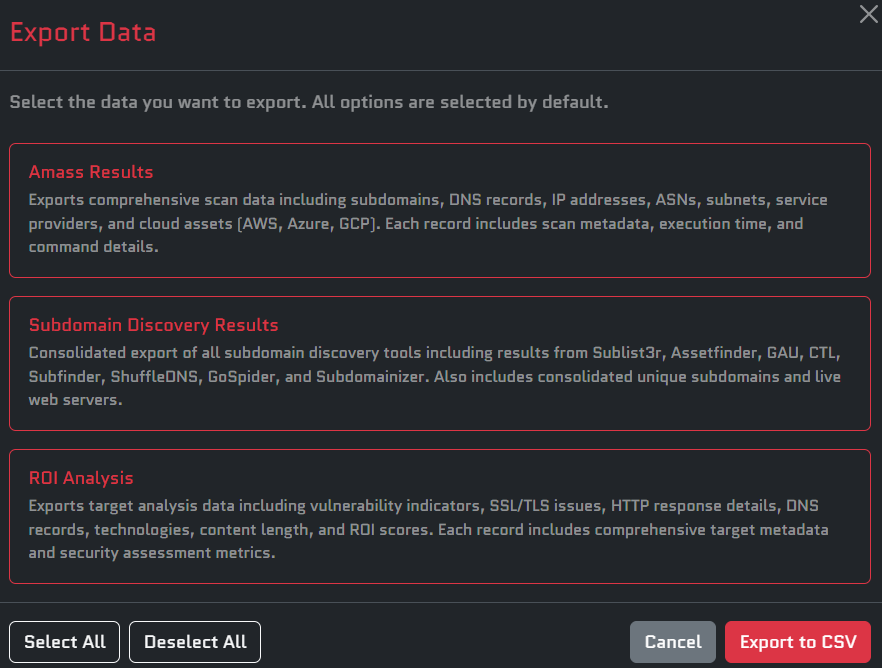

<h1 align="center">
Ars0n Framework v2
</h1>

<h3 align="center">Learn & Automate <a href="https://youtube.com/@rs0n_live">rs0n's</a> Bug Bounty Hunting Methodology</h3>

<p align="center">
    <em>🚨 Pre-Alpha Release Out now!!  Beta Launch @ DEFCON 33 Bug Bounty Hunting Village!!! 🚨</em>
</p>

<div align="center">
  <p>Walkthrough of Pre-Alpha Release</p>
  <a href="https://www.youtube.com/watch?v=u-yPpd0UH8w">
    
  </a>
  <p>New Features Added to Pre-Alpha Release</p>
  <a href="https://www.youtube.com/watch?v=kAO0stO-hBg">
    
  </a>
</div>

<p align="center">
    <a href="https://github.com/owasp-amass/amass">Amass</a> - Advanced attack surface mapping and asset discovery tool for security research<br>
    <a href="https://github.com/projectdiscovery/subfinder">Subfinder</a> - Fast and reliable subdomain enumeration tool with multiple data sources<br>
    <a href="https://github.com/aboul3la/Sublist3r">Sublist3r</a> - Fast subdomain enumeration tool using various search engines and data sources<br>
    <a href="https://github.com/tomnomnom/assetfinder">Assetfinder</a> - Find assets related to a domain using various data sources and APIs<br>
    <a href="https://github.com/projectdiscovery/httpx">Httpx</a> - Fast and multi-purpose HTTP toolkit for web reconnaissance and scanning<br>
    <a href="https://github.com/jaeles-project/gospider">GoSpider</a> - Fast web spider written in Go for crawling and extracting URLs<br>
    <a href="https://github.com/nsonaniya2010/SubDomainizer">Subdomainizer</a> - Advanced subdomain enumeration tool with multiple discovery methods<br>
    <a href="https://github.com/digininja/CeWL">CeWL</a> - Custom word list generator that spiders websites to create targeted wordlists<br>
    <a href="https://github.com/projectdiscovery/shuffledns">ShuffleDNS</a> - Mass DNS resolver with wildcard filtering and validation capabilities<br>
    <a href="https://github.com/projectdiscovery/nuclei">Nuclei</a> - Fast and customizable vulnerability scanner with extensive template library<br>
    <a href="https://github.com/projectdiscovery/katana">Katana</a> - Fast and powerful web crawler for discovering hidden endpoints and content<br>
    <a href="https://github.com/ffuf/ffuf">FFuf</a> - Fast web fuzzer with support for multiple protocols and advanced filtering<br>
    <a href="https://github.com/lc/gau">GAU</a> - Get All URLs tool that fetches known URLs from various historical data sources<br>
    <a href="https://github.com/pdiscoveryio/ctl">CTL</a> - Certificate Transparency Log tool for discovering subdomains from SSL certificates<br>
    And much more!
</p>

<p align="center">My full bug bounty hunting methodology built into a single framework!  Automate the most common bug bounty hunting workflows and <em>Earn While You Learn</em>!</p>

<p align="center">The goal of this tool is to eliminate the barrier of entry for bug bounty hunting.  My hope is that someone can pick up this tool and start hunting on day one of their AppSec journey 🚀</p>

<p align="center">
    
    
</p>

<p align="center">Each step of the methodology includes a <em>"Help Me Learn!"</em> dropdown section that includes answers to the most common questions.  Most answers can be expanded by clicking the <em>"Learn More"</em> link at the end of the statement.  Clicking this link opens a modal with detailed bug bounty hunting guidance and step-by-step instructions to complete that stage of the methodology.</p>

<p align="center">
    
</p>

<p align="center">
    The result of the Wildcard workflow is an ROI Report that includes detailed information about each possible target, as well as a Return On Investment (ROI) score that estimates the value a specific web application gives a bug bounty hunter.  <b>This feature is the REAL value of my framework.</b>  The functionality is very simple today, but over time I will be building in years of bug bounty hunting experience to help provide guidance to reserachers who are just beginning their journey.  This score helps level the playing field for new bug bounty hunters and can provide guidance at one of the most challenging stages of the methodology.
</p>

<p align="center">
    
    
    
</p>

<p align="center">
    In addition to the ROI report, detailed information about each target is collected and can be used in a variety of ways by experienced bug bounty hunters and beginners alike!
</p>

<p align="center">
    
    
    
    
</p>

<p align="center">
    Adjust the concurrency and rate limiting for each individual tool to perfectly dial in your scanning strategy!
</p>

<p align="center">
    
</p>

<p align="center">
    Export your scan results to a CSV and use the data however you would like!
</p>

<p align="center">
    
</p>

## Installation Instructions

Thank you for your interest in the Ars0n Framework v2! Follow the instructions below for your operating system to get started with the final pre-alpha demo.

### Windows Installation

#### Manual Installation

1. **Install Docker Desktop**
   - Download Docker Desktop for Windows from [docker.com](https://docs.docker.com/desktop/install/windows-install/)
   - Run the installer and follow the setup wizard
   - Enable WSL 2 backend when prompted
   - Restart your computer when installation is complete

2. **Install Git**
   - Download Git for Windows from [git-scm.com](https://git-scm.com/download/win)
   - Run the installer with default settings
   - Choose "Use the Nano editor by default" when prompted
   - Select "Git from the command line and also from 3rd-party software"

3. **Clone and Run the Framework**
   - Open PowerShell or Command Prompt
   - Run the following commands:
   ```bash
   git clone https://github.com/R-s0n/ars0n-framework-v2.git
   cd ars0n-framework-v2
   git checkout final-pre-alpha
   docker-compose up --build
   ```

4. **Access the Application**
   - Open your web browser and navigate to `http://localhost:3000`

#### Automated Installation Script

Copy and paste this script into PowerShell (run as Administrator):

```powershell
# Download and install Docker Desktop
Write-Host "Downloading Docker Desktop..." -ForegroundColor Green
$dockerUrl = "https://desktop.docker.com/win/main/amd64/Docker%20Desktop%20Installer.exe"
$dockerInstaller = "$env:TEMP\DockerDesktopInstaller.exe"
Invoke-WebRequest -Uri $dockerUrl -OutFile $dockerInstaller
Write-Host "Installing Docker Desktop..." -ForegroundColor Green
Start-Process -FilePath $dockerInstaller -ArgumentList "install", "--quiet", "--accept-license" -Wait

# Download and install Git
Write-Host "Downloading Git..." -ForegroundColor Green
$gitUrl = "https://github.com/git-for-windows/git/releases/latest/download/Git-2.50.0-64-bit.exe"
$gitInstaller = "$env:TEMP\Git-installer.exe"
Invoke-WebRequest -Uri $gitUrl -OutFile $gitInstaller
Write-Host "Installing Git..." -ForegroundColor Green
Start-Process -FilePath $gitInstaller -ArgumentList "/SILENT", "/COMPONENTS=icons,ext\reg\shellhere,assoc,assoc_sh" -Wait

# Clone and start the framework
Write-Host "Cloning Ars0n Framework v2..." -ForegroundColor Green
cd $env:USERPROFILE
git clone https://github.com/R-s0n/ars0n-framework-v2.git
cd ars0n-framework-v2
git checkout final-pre-alpha

Write-Host "Starting Docker Desktop..." -ForegroundColor Green
Start-Process "C:\Program Files\Docker\Docker\Docker Desktop.exe"
Start-Sleep 30

Write-Host "Building and starting the framework..." -ForegroundColor Green
docker-compose up --build -d

Write-Host "Installation complete! Access the framework at http://localhost:3000" -ForegroundColor Yellow
Start-Process "http://localhost:3000"
```

### macOS Installation

#### Manual Installation

1. **Install Docker Desktop**
   - Download Docker Desktop for Mac from [docker.com](https://docs.docker.com/desktop/install/mac-install/)
   - For Intel Macs: Download the Intel chip version
   - For Apple Silicon Macs: Download the Apple chip version
   - Open the .dmg file and drag Docker to Applications
   - Launch Docker Desktop and accept the terms

2. **Install Git** (if not already installed)
   - Option 1: Install Xcode Command Line Tools
     ```bash
     xcode-select --install
     ```
   - Option 2: Download from [git-scm.com](https://git-scm.com/download/mac)
   - Option 3: Install via Homebrew
     ```bash
     brew install git
     ```

3. **Clone and Run the Framework**
   - Open Terminal
   - Run the following commands:
   ```bash
   git clone https://github.com/R-s0n/ars0n-framework-v2.git
   cd ars0n-framework-v2
   git checkout final-pre-alpha
   docker-compose up --build
   ```

4. **Access the Application**
   - Open your web browser and navigate to `http://localhost:3000`

#### Automated Installation Script

Copy and paste this script into Terminal:

```bash
#!/bin/bash

echo "🚀 Installing Ars0n Framework v2 on macOS..."

# Detect Mac architecture
ARCH=$(uname -m)
if [[ "$ARCH" == "arm64" ]]; then
    DOCKER_URL="https://desktop.docker.com/mac/main/arm64/Docker.dmg"
    echo "📱 Detected Apple Silicon Mac"
else
    DOCKER_URL="https://desktop.docker.com/mac/main/amd64/Docker.dmg"
    echo "💻 Detected Intel Mac"
fi

# Install Git if not present
if ! command -v git &> /dev/null; then
    echo "📦 Installing Git..."
    if command -v brew &> /dev/null; then
        brew install git
    else
        echo "🛠️ Installing Xcode Command Line Tools..."
        xcode-select --install
        echo "⏳ Please complete Xcode Command Line Tools installation and run this script again"
        exit 1
    fi
fi

# Install Docker Desktop if not present
if ! command -v docker &> /dev/null; then
    echo "🐳 Downloading Docker Desktop..."
    curl -L "$DOCKER_URL" -o ~/Downloads/Docker.dmg
    
    echo "📦 Installing Docker Desktop..."
    hdiutil attach ~/Downloads/Docker.dmg
    cp -R /Volumes/Docker/Docker.app /Applications/
    hdiutil detach /Volumes/Docker
    
    echo "🚀 Starting Docker Desktop..."
    open /Applications/Docker.app
    echo "⏳ Please accept Docker terms and wait for Docker to start, then press Enter to continue..."
    read
fi

# Clone and start the framework
echo "📡 Cloning Ars0n Framework v2..."
cd ~/Downloads
git clone https://github.com/R-s0n/ars0n-framework-v2.git
cd ars0n-framework-v2
git checkout final-pre-alpha

echo "🔨 Building and starting the framework..."
docker-compose up --build -d

echo "✅ Installation complete! Access the framework at http://localhost:3000"
open http://localhost:3000
```

### Linux Installation

#### Ubuntu/Debian Manual Installation

1. **Install Docker and Docker Compose**
   ```bash
   # Update package database
   sudo apt update
   
   # Install prerequisites
   sudo apt install -y apt-transport-https ca-certificates curl gnupg lsb-release
   
   # Add Docker's official GPG key
   curl -fsSL https://download.docker.com/linux/ubuntu/gpg | sudo gpg --dearmor -o /usr/share/keyrings/docker-archive-keyring.gpg
   
   # Add Docker repository
   echo "deb [arch=amd64 signed-by=/usr/share/keyrings/docker-archive-keyring.gpg] https://download.docker.com/linux/ubuntu $(lsb_release -cs) stable" | sudo tee /etc/apt/sources.list.d/docker.list > /dev/null
   
   # Install Docker
   sudo apt update
   sudo apt install -y docker-ce docker-ce-cli containerd.io docker-compose-plugin
   
   # Add user to docker group
   sudo usermod -aG docker $USER
   newgrp docker
   ```

2. **Install Git** (if not already installed)
   ```bash
   sudo apt install -y git-all
   ```

3. **Clone and Run the Framework**
   ```bash
   git clone https://github.com/R-s0n/ars0n-framework-v2.git
   cd ars0n-framework-v2
   git checkout final-pre-alpha
   docker compose up --build
   ```

4. **Access the Application**
   - Open your web browser and navigate to `http://localhost:3000`

#### Fedora/RHEL/CentOS Manual Installation

1. **Install Docker and Docker Compose**
   ```bash
   # Install Docker
   sudo dnf install -y dnf-plugins-core
   sudo dnf config-manager --add-repo https://download.docker.com/linux/fedora/docker-ce.repo
   sudo dnf install -y docker-ce docker-ce-cli containerd.io docker-compose-plugin
   
   # Start and enable Docker
   sudo systemctl start docker
   sudo systemctl enable docker
   
   # Add user to docker group
   sudo usermod -aG docker $USER
   newgrp docker
   ```

2. **Install Git** (if not already installed)
   ```bash
   sudo dnf install -y git-all
   ```

3. **Clone and Run the Framework**
   ```bash
   git clone https://github.com/R-s0n/ars0n-framework-v2.git
   cd ars0n-framework-v2
   git checkout final-pre-alpha
   docker compose up --build
   ```

#### Automated Installation Script for Ubuntu/Debian

Copy and paste this script into Terminal:

```bash
#!/bin/bash

echo "🚀 Installing Ars0n Framework v2 on Ubuntu/Debian..."

# Update system
echo "📦 Updating system packages..."
sudo apt update

# Install prerequisites
echo "🛠️ Installing prerequisites..."
sudo apt install -y apt-transport-https ca-certificates curl gnupg lsb-release git-all

# Install Docker
if ! command -v docker &> /dev/null; then
    echo "🐳 Installing Docker..."
    
    # Add Docker's official GPG key
    curl -fsSL https://download.docker.com/linux/ubuntu/gpg | sudo gpg --dearmor -o /usr/share/keyrings/docker-archive-keyring.gpg
    
    # Add Docker repository
    echo "deb [arch=amd64 signed-by=/usr/share/keyrings/docker-archive-keyring.gpg] https://download.docker.com/linux/ubuntu $(lsb_release -cs) stable" | sudo tee /etc/apt/sources.list.d/docker.list > /dev/null
    
    # Install Docker
    sudo apt update
    sudo apt install -y docker-ce docker-ce-cli containerd.io docker-compose-plugin
    
    # Add user to docker group
    sudo usermod -aG docker $USER
    
    echo "⚠️ Please log out and log back in for Docker permissions to take effect"
    echo "Then run this script again to continue the installation"
    exit 0
fi

# Clone and start the framework
echo "📡 Cloning Ars0n Framework v2..."
cd ~/Downloads
git clone https://github.com/R-s0n/ars0n-framework-v2.git
cd ars0n-framework-v2
git checkout final-pre-alpha

echo "🔨 Building and starting the framework..."
docker compose up --build -d

echo "✅ Installation complete! Access the framework at http://localhost:3000"

# Open browser if available
if command -v xdg-open &> /dev/null; then
    xdg-open http://localhost:3000
elif command -v gnome-open &> /dev/null; then
    gnome-open http://localhost:3000
fi
```

#### Automated Installation Script for Fedora/RHEL/CentOS

Copy and paste this script into Terminal:

```bash
#!/bin/bash

echo "🚀 Installing Ars0n Framework v2 on Fedora/RHEL/CentOS..."

# Install Docker
if ! command -v docker &> /dev/null; then
    echo "🐳 Installing Docker..."
    
    # Install Docker
    sudo dnf install -y dnf-plugins-core
    sudo dnf config-manager --add-repo https://download.docker.com/linux/fedora/docker-ce.repo
    sudo dnf install -y docker-ce docker-ce-cli containerd.io docker-compose-plugin git-all
    
    # Start and enable Docker
    sudo systemctl start docker
    sudo systemctl enable docker
    
    # Add user to docker group
    sudo usermod -aG docker $USER
    
    echo "⚠️ Please log out and log back in for Docker permissions to take effect"
    echo "Then run this script again to continue the installation"
    exit 0
fi

# Clone and start the framework
echo "📡 Cloning Ars0n Framework v2..."
cd ~/Downloads
git clone https://github.com/R-s0n/ars0n-framework-v2.git
cd ars0n-framework-v2
git checkout final-pre-alpha

echo "🔨 Building and starting the framework..."
docker compose up --build -d

echo "✅ Installation complete! Access the framework at http://localhost:3000"

# Open browser if available
if command -v xdg-open &> /dev/null; then
    xdg-open http://localhost:3000
elif command -v gnome-open &> /dev/null; then
    gnome-open http://localhost:3000
fi
```

### Additional Notes

- **System Requirements**: Ensure your system has at least 8GB of RAM and 10GB of free disk space
- **Firewall**: Make sure ports 3000 and 8443 are not blocked by your firewall
- **Antivirus**: Some antivirus software may interfere with Docker. You may need to add exceptions for Docker and the framework directory
- **Updates**: This installation targets the `final-pre-alpha` release. For the latest development version, omit the `git checkout final-pre-alpha` command

### Troubleshooting

If you encounter issues:
1. Ensure Docker is running and you can execute `docker --version`
2. Verify Git is installed with `git --version`
3. Check that you have sufficient disk space and memory
4. Try running `docker-compose down` followed by `docker-compose up --build` to restart fresh
5. For additional support, please open an issue on the [GitHub repository](https://github.com/R-s0n/ars0n-framework-v2/issues)

<p align="right">~ by rs0n w/ ❤️</p>

## License

This project is licensed under the GNU General Public License v3.0 (GPL-3.0). This means:

- You can freely use, modify, and distribute this software
- If you distribute modified versions, you must:
  - Make your source code available
  - Include the original copyright notice
  - Use the same license (GPL-3.0)
  - Document your changes

For more details, see the [LICENSE](LICENSE) file in the repository.

<p align="center"><em>Copyright (C) 2025 Arson Security, LLC</em></p>
