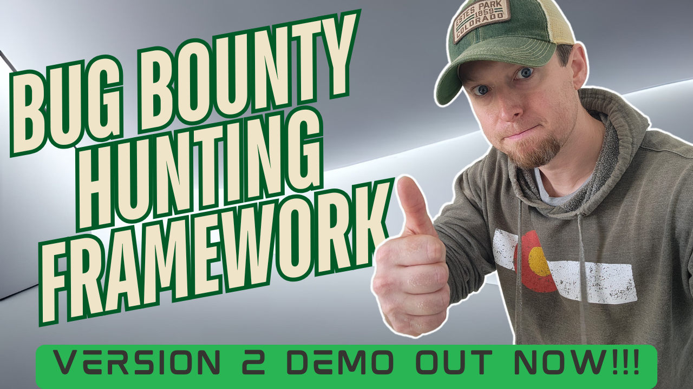
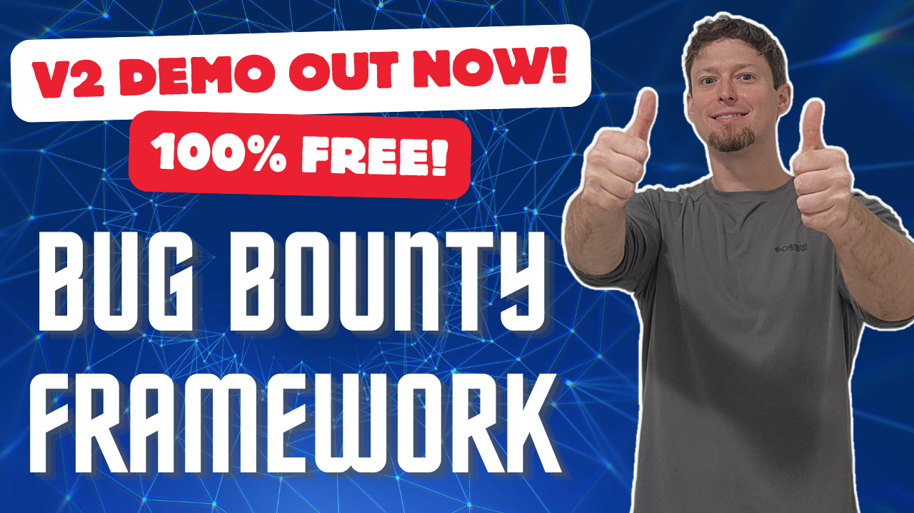

<h1 align="center">
Ars0n Framework v2
</h1>

<p align="center">
  <a href="#about">About</a> •
  <a href="#download-and-install">Download & Install</a> •
  <a href="#workflows">Workflows</a> •
  <a href="#troubleshooting">Troubleshooting</a> •
  <a href="#frequently-asked-questions">FAQs</a> •
  <a href="https://www.youtube.com/@rs0n_live" target=”_blank”>YouTube</a> •
  <a href="https://www.linkedin.com/in/harrison-richardson-rs0n-7a55bb158/" target=”_blank”>LinkedIn</a>
</p>

<p align="center">
    <em>🚨 Pre-Alpha Release Out now!!  Beta Launch @ DEFCON 33 Bug Bounty Hunting Village!!! 🚨</em>
</p>

<p align="center">My full bug bounty hunting methodology built into a single framework!  Automate the most common bug bounty hunting workflows and <em>Earn While You Learn</em>!</p>

<p align="center">The goal of this tool is to eliminate the barrier of entry for bug bounty hunting.  My hope is that someone can pick up this tool and start hunting on day one of their AppSec journey 🚀</p>

<h4 align="center">
🤠 Did you know that over 95% of scientists believe there is a direct correlation between the amount of coffee I drink and how quickly I can build new features?  Crazy, right?!  Well, now you can test their hypothesis and Buy Me a Coffee through this fancy button!!  🤯
<br>
<br>
<a href="https://www.buymeacoffee.com/rs0n.evolv3" target="_blank"></a>
</h4>

## About

Howdy!  My name is Harrison Richardson, or `rs0n` (arson) when I want to feel cooler than I really am.  The code in this repository started as a small collection of scripts to help automate many of the common Bug Bounty hunting processes I found myself repeating.  Over time, I built these scripts into an open-source framework that helped thousands of people around the world begin their bug bounty hunting journey.  

However, the first implementation of the framework had a wide range of issues.  The majority of the problems were a result of the tool never being designed with the intent of being shared as an open-source project.  So I got to work on a version 2 that would solve these problems and bring my vision to life!

**The Ars0n Framework V2** is designed to be a tool that allows people to start REAL bug bounty hunting against actual targets on day one!  The framework acts as a wrapper around 20+ widely used bug bounty hunting tools and a clever UI design forces the user into a correct hunting methodology.  It is literally impossible to use this tool without going through rs0n's process!  

The results of each tool are stored in a central database and can be used for understanding/visualizing the target company's attack surface.  Each section also includes a "Help Me Learn!" dropdown that includes a lession plan to help the user understand what part of the methodology they are at, what they are trying to acheive, and most importantly the "Why?" behind it.

My hope is that this modular framework will act as a canvas to help share what I've learned over my career to the next generation of Security Engineers!  Trust me, we need all the help we can get!!

<p align="center"><b>Pre-Alpha Demo Videos</b></p>

<div align="center">
  <a href="https://www.youtube.com/watch?v=u-yPpd0UH8w">
    
  </a>&nbsp;&nbsp;&nbsp;&nbsp;&nbsp;&nbsp;&nbsp;&nbsp;&nbsp;&nbsp;
  <a href="https://www.youtube.com/watch?v=kAO0stO-hBg">
    
  </a>
</div><br>

<p align="center"><b>The Ars0n Framework v2 Includes All These Tools And More!</b></p>

<p align="center">
    <a href="https://github.com/owasp-amass/amass">Amass</a> - Advanced attack surface mapping and asset discovery tool for security research<br>
    <a href="https://github.com/projectdiscovery/subfinder">Subfinder</a> - Fast and reliable subdomain enumeration tool with multiple data sources<br>
    <a href="https://github.com/aboul3la/Sublist3r">Sublist3r</a> - Fast subdomain enumeration tool using various search engines and data sources<br>
    <a href="https://github.com/tomnomnom/assetfinder">Assetfinder</a> - Find assets related to a domain using various data sources and APIs<br>
    <a href="https://github.com/projectdiscovery/httpx">Httpx</a> - Fast and multi-purpose HTTP toolkit for web reconnaissance and scanning<br>
    <a href="https://github.com/jaeles-project/gospider">GoSpider</a> - Fast web spider written in Go for crawling and extracting URLs<br>
    <a href="https://github.com/nsonaniya2010/SubDomainizer">Subdomainizer</a> - Advanced subdomain enumeration tool with multiple discovery methods<br>
    <a href="https://github.com/digininja/CeWL">CeWL</a> - Custom word list generator that spiders websites to create targeted wordlists<br>
    <a href="https://github.com/projectdiscovery/shuffledns">ShuffleDNS</a> - Mass DNS resolver with wildcard filtering and validation capabilities<br>
    <a href="https://github.com/projectdiscovery/nuclei">Nuclei</a> - Fast and customizable vulnerability scanner with extensive template library<br>
    <a href="https://github.com/projectdiscovery/katana">Katana</a> - Fast and powerful web crawler for discovering hidden endpoints and content<br>
    <a href="https://github.com/ffuf/ffuf">FFuf</a> - Fast web fuzzer with support for multiple protocols and advanced filtering<br>
    <a href="https://github.com/lc/gau">GAU</a> - Get All URLs tool that fetches known URLs from various historical data sources<br>
    <a href="https://github.com/pdiscoveryio/ctl">CTL</a> - Certificate Transparency Log tool for discovering subdomains from SSL certificates<br>
    <a href="https://github.com/projectdiscovery/dnsx">DNSx</a> - Fast and multi-purpose DNS toolkit for running multiple DNS queries<br>
    <a href="https://github.com/initstring/cloud_enum">Cloud Enum</a> - Multi-cloud OSINT tool for enumerating public resources in AWS, Azure, and Google Cloud<br>
    <a href="https://github.com/j3ssie/metabigor">Metabigor</a> - OSINT tool for network intelligence gathering including ASN and IP range discovery<br>
    <a href="https://github.com/gwen001/github-search">GitHub Recon</a> - GitHub reconnaissance tool for discovering organization mentions and domain patterns<br>
    <a href="https://github.com/projectdiscovery/naabu">Naabu</a> - Fast port scanner for discovering open ports and services<br>
    <a href="https://github.com/whoxy/whoxy">Reverse Whois</a> - Reverse WHOIS lookup using Whoxy to find domains registered by the same entity<br>
    <a href="https://securitytrails.com">SecurityTrails</a> - Comprehensive DNS, domain, and IP data provider for digital asset discovery<br>
    <a href="https://censys.io">Censys</a> - Internet-wide scanning platform for discovering and monitoring assets<br>
    <a href="https://shodan.io">Shodan</a> - Search engine for internet-connected devices and services<br>
</p>

## Download And Install

This framework consists of 20+ Docker containers along w/ a Docker Compose Manifest to automate the process of deploying these containers.

1. Download the Zip File for the <a href="https://github.com/R-s0n/ars0n-framework-v2/releases/download/beta-test/ars0n-framework-v2-beta-0.0.0.zip">latest release</a>
2. Unzip the files
3. Navigate to the directory with the `docker-compose.yml` file
4. Run `docker-compose up --build`

*HINT: If you get a docker error, the problem is probably w/ docker, not my framework*

### Windows

**Step 1:** Download the framework
```powershell
Invoke-WebRequest -Uri "https://github.com/R-s0n/ars0n-framework-v2/releases/download/beta-test/ars0n-framework-v2-beta-0.0.0.zip" -OutFile "ars0n-framework-v2.zip"
```

**Step 2:** Extract the zip file
```powershell
Expand-Archive -Path "ars0n-framework-v2.zip" -DestinationPath "."
```

**Step 3:** Navigate to the framework directory
```powershell
cd ars0n-framework-v2-beta-0.0.0
```

**Step 4:** Start the framework
```powershell
docker-compose up --build
```

### Mac

**Step 1:** Download the framework
```bash
curl -L -o ars0n-framework-v2.zip "https://github.com/R-s0n/ars0n-framework-v2/releases/download/beta-test/ars0n-framework-v2-beta-0.0.0.zip"
```

**Step 2:** Extract the zip file
```bash
unzip ars0n-framework-v2.zip
```

**Step 3:** Navigate to the framework directory
```bash
cd ars0n-framework-v2-beta-0.0.0
```

**Step 4:** Start the framework
```bash
docker-compose up --build
```

### Linux

**Step 1:** Download the framework
```bash
wget "https://github.com/R-s0n/ars0n-framework-v2/releases/download/beta-test/ars0n-framework-v2-beta-0.0.0.zip"
```

**Step 2:** Extract the zip file
```bash
unzip ars0n-framework-v2-beta-0.0.0.zip
```

**Step 3:** Navigate to the framework directory
```bash
cd ars0n-framework-v2-beta-0.0.0
```

**Step 4:** Start the framework
```bash
docker-compose up --build
```

## Workflows

Coming Soon...

## Troubleshooting

This section covers common issues you may encounter when setting up and running the Ars0n Framework v2. Most problems are related to Docker configuration or system requirements.

### Docker Not Installed

**Error:** `docker: command not found` or `docker-compose: command not found`

**Solution:**
- **Windows:** Download and install [Docker Desktop for Windows](https://docs.docker.com/desktop/install/windows-install/)
- **Mac:** Download and install [Docker Desktop for Mac](https://docs.docker.com/desktop/install/mac-install/)
- **Linux (Ubuntu/Debian):**
  ```bash
  sudo apt update
  sudo apt install docker.io docker-compose
  sudo systemctl start docker
  sudo systemctl enable docker
  sudo usermod -aG docker $USER
  ```

### Verify Docker Installation

Before running the Ars0n Framework, test your Docker installation with these simple examples:

**Test Docker:**
```bash
docker run hello-world
```

You should see output like:
```
Hello from Docker!
This message shows that your installation appears to be working correctly.
```

**Test Docker Compose:**

Create a file named `test-docker-compose.yml`:
```yaml
services:
  hello-world:
    image: hello-world
    container_name: test-hello-world
```

Then run:
```bash
docker-compose -f test-docker-compose.yml up
```

You should see the same hello-world message. If both tests pass, your Docker installation is working correctly and you can proceed with the Ars0n Framework.

### Docker Service Not Running

**Error:** `Cannot connect to the Docker daemon` or `docker daemon is not running`

**Solution:**
- **Windows:** Start Docker Desktop application
- **Mac:** Start Docker Desktop application
- **Linux:**
  ```bash
  sudo systemctl start docker
  sudo systemctl status docker
  ```

### Permission Denied Errors

**Error:** `permission denied while trying to connect to the Docker daemon socket`

**Solution:**
- **Linux:** Add your user to the docker group and restart your session:
  ```bash
  sudo usermod -aG docker $USER
  newgrp docker
  ```
- **Windows/Mac:** Ensure Docker Desktop is running with appropriate permissions

### Port Conflicts

**Error:** `port is already allocated` or `bind: address already in use`

**Solution:**
- Check if ports 3000, 8000, 8443, or 5432 are already in use:
  ```bash
  # Linux/Mac
  sudo netstat -tulpn | grep :3000
  sudo netstat -tulpn | grep :8443
  
  # Windows
  netstat -ano | findstr :3000
  netstat -ano | findstr :8443
  ```
- Stop conflicting services or modify the docker-compose.yml to use different ports

### Insufficient Resources

**Error:** `no space left on device` or `memory allocation failed`

**Solution:**
- **Windows/Mac:** Increase Docker Desktop memory allocation (8GB+ recommended)
- **Linux:** Check available disk space and memory:
  ```bash
  df -h
  free -h
  ```
- Clean up Docker resources:
  ```bash
  docker system prune -a
  docker volume prune
  ```

### Corporate/Enterprise Docker Restrictions

**Error:** `authentication required` or `registry access denied`

**Solution:**
- Configure Docker to use your organization's registry:
  ```bash
  docker login your-company-registry.com
  ```
- Update docker-compose.yml to use authenticated image sources
- Contact your IT department for Docker Enterprise configuration

### Docker-in-Docker (DinD) Issues

**Error:** `Cannot connect to the Docker daemon` when running inside containers

**Solution:**
- Ensure Docker socket is properly mounted in docker-compose.yml
- For enterprise environments, configure Docker BuildKit:
  ```bash
  export DOCKER_BUILDKIT=1
  docker-compose up --build
  ```

### Database Connection Issues

**Error:** `connection refused` or `database is starting up`

**Solution:**
- Wait for the database to fully initialize (health check may take 30+ seconds)
- Check database container logs:
  ```bash
  docker logs ars0n-framework-v2-db-1
  ```
- Restart the database service:
  ```bash
  docker-compose restart db
  ```

### Container Build Failures

**Error:** `failed to build` or `build context`

**Solution:**
- Ensure all required files are present in the project directory
- Check Dockerfile syntax and dependencies
- Clear Docker build cache:
  ```bash
  docker builder prune
  docker-compose build --no-cache
  ```

### Network Connectivity Issues

**Error:** `network unreachable` or `DNS resolution failed`

**Solution:**
- Check if your firewall is blocking Docker network traffic
- Configure DNS settings in docker-compose.yml if needed
- For corporate networks, configure proxy settings:
  ```bash
  export HTTP_PROXY=http://proxy.company.com:8080
  export HTTPS_PROXY=http://proxy.company.com:8080
  ```

### Windows-Specific Issues

**Error:** `WSL 2 installation is incomplete` or `Hyper-V not enabled`

**Solution:**
- Enable WSL 2: `wsl --install`
- Enable Hyper-V: `Enable-WindowsOptionalFeature -Online -FeatureName Microsoft-Hyper-V -All`
- Restart your computer after making these changes

### Mac-Specific Issues

**Error:** `Docker Desktop is not running` or `resource limits exceeded`

**Solution:**
- Increase Docker Desktop memory allocation (8GB+ recommended)
- Ensure Docker Desktop has necessary permissions
- Check macOS security settings for Docker

### Linux-Specific Issues

**Error:** `cgroup memory limit exceeded` or `seccomp not supported`

**Solution:**
- Update your kernel to a recent version
- Install required packages:
  ```bash
  sudo apt install linux-modules-extra-$(uname -r)
  ```
- Configure cgroup limits in /etc/docker/daemon.json

### Getting Help

**⚠️ IMPORTANT:** Before asking for help, please ensure you've provided all the information requested below. Without these details, it becomes very difficult for rs0n to assist you effectively, and will significantly delay response times.

#### When to Use Discussions vs Issues

**Use Discussions** for:
- Installation and setup problems
- Docker configuration issues
- Environment-specific problems
- Questions about getting the tool running

**Use Issues** for:
- Bugs in the tool itself (after it's successfully running)
- Feature requests
- Security vulnerabilities
- Problems with tool functionality

#### Discussion Template (Installation/Setup Issues)

If you're having trouble getting the Ars0n Framework to run, create a **Discussion** and copy/paste this template:

```markdown
## System Information
- Operating System: [Windows 11 / macOS 14.1 / Ubuntu 22.04 / etc.]
- Docker Version: [Output of `docker --version`]
- Docker Compose Version: [Output of `docker-compose --version`]
- Available RAM: [How much RAM your system has]
- Available Disk Space: [How much free disk space]

## Error Details
- Complete error message(s):
- Step where the error occurred:
- What you were trying to do when the error happened:

## Troubleshooting Steps Taken
- [ ] Verified Docker installation with `docker run hello-world`
- [ ] Verified Docker Compose with test manifest
- [ ] Checked container logs: `docker-compose logs [service-name]`
- [ ] Verified system meets minimum requirements
- [ ] Tried running with verbose output: `docker-compose up --build --verbose`

## Container Logs
    [Paste the output of: docker-compose logs [relevant-service-name]]

## Additional Context
- Are you running this in a corporate/enterprise environment?
- Do you have any security software that might interfere with Docker?
- Have you successfully run other Docker containers on this system?
```

#### Issue Template (Tool Functionality Problems)

If the Ars0n Framework is running but you're experiencing issues with the tool itself, create an **Issue** and copy/paste this template:

```markdown
## Environment
- Operating System: [Windows 11 / macOS 14.1 / Ubuntu 22.04 / etc.]
- Docker Version: [Output of `docker --version`]
- Docker Compose Version: [Output of `docker-compose --version`]
- Ars0n Framework Version: [Current version you're running]

## Bug Description
- What were you trying to do?
- What happened instead?
- What did you expect to happen?

## Steps to Reproduce
1. [Step 1]
2. [Step 2]
3. [Step 3]
4. [Continue as needed]

## Error Messages
    [Paste any error messages, stack traces, or console output]

## Browser Console Logs
    [If applicable, paste browser console errors]

## Screenshots
[If applicable, include screenshots of the issue]

## Additional Information
- Does this happen with all targets or specific ones?
- Does this happen consistently or intermittently?
- Any recent changes to your environment?
```

#### Before Submitting

1. **Search existing Discussions/Issues** - Your problem may already be solved
2. **Test with the hello-world container** - Ensure Docker is working correctly
3. **Check the troubleshooting section above** - Many common issues are already covered
4. **Provide complete logs** - Partial information makes debugging much harder
5. **Be specific** - "It doesn't work" doesn't help; describe exactly what happens

**Remember:** The more complete information you provide, the faster rs0n can help you resolve your issue!

## Frequently Asked Questions

Coming Soon...

## License

This project is licensed under the GNU General Public License v3.0 (GPL-3.0). This means:

- You can freely use, modify, and distribute this software
- If you distribute modified versions, you must:
  - Make your source code available
  - Include the original copyright notice
  - Use the same license (GPL-3.0)
  - Document your changes

For more details, see the [LICENSE](LICENSE) file in the repository.

<p align="right">~ by rs0n w/ ❤️</p>
<p align="center"><em>Copyright (C) 2025 Arson Security, LLC</em></p>
